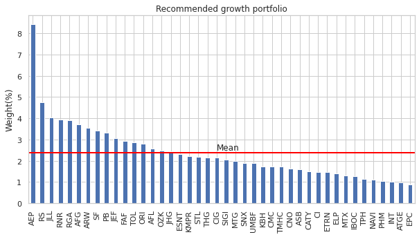

#Track positions of the investment companies.

##Companies that are present in the following analysis: Ark Invest, BlackRock, Invesco, Global X.

After the analysis of the companies' portfolios we are going to leverage ideas of James O'Shaughnessy from his book 'What works on Wall Streat' to choose the best stocks from the ETFs with the growth potential according to his growth strategy.

